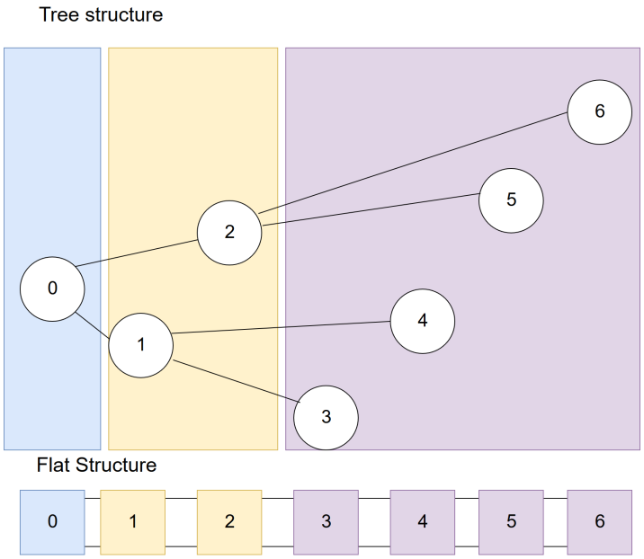

## UE4 Dijkstra Algorithm

### 1) Usage for CLI program

1) clone this project  
2) mvn install  
3) jar can be found in "graphsearch-cli/target/dijkstra"  
3) java -jar dijkstra <absolute path to input file>  
    * if it was a valid input file you will be asked to enter a station you want to start from and a station you want to reach
    * if the station to, from both exist the shortest path will be searched and displayed
    * after that you will be asked to enter to and from again
4) press Ctrl + C to exit the program


### 2) Implementation Details
We chose to use an adjacency list because public transport networks are usually sparse graphs.
We chose to use a directed graph although not required for the test data, because it is easier to expand later. For example 
driving into the other direction can take more or less time and would not be possible with an undirected graph. Or if for example a 
line can not stop in one direction due to construction work.

#### Data Structures:
We used the Lombok library to easily generate equals, hashCode, getter and setter methods.
Which keeps the classes short and readable (no Java-bloat).

##### Stations
For type safety reasons we chose to not save the station name as a String but rather as a station object which contains the name. This
allows us to easily distinguish between Stations and Lines.
* consists of:
    - String name  

##### Line
Again for type safety reasons a wrapping class.
* consists of:
    - String name

##### StationNode
The "vertices" for our implementation.
* consists of:
    - Station
    - Set<LineSegment> connectedSegments
The LineSegment Set is our adjacency list. We chose a set because there can not be two identical paths from one StationNode to another.
Also there is no ordering or priority.
    
##### LineSegment
The "edges" for our implementation.
* consists of  
    - int duration
    - Station previous
    - Station next
    - Line
We save the line on the edge so we can decide which edge is the most "cost efficient". Switching lines costs **5 minutes** by default.
It also makes differentiating between multiple edges going from one Station to the same destination easier.

##### Graph
Where the whole public transport network is illustrated. The HashMap<Station, StationNode> is used for easier indexing of the StationNodes.
The file format allows us to do this because 2 **different** Stations can never have the same name.
* consists of:
    - HashMap<Station, StationNode> 
        
#### Dijkstra
```Java
    if(to.equals(from)) throw new DijkstraException("Station to and from should not be equal.");
    if(graph.getStationNode(from) == null) throw new DijkstraException("The station you want to travel from does not exist.");
    if(graph.getStationNode(to) == null) throw new DijkstraException("The station you want to travel to does not exist.");
``` 
First of the Station to and from will be checked:
    * if they are equal the algorithm does not start
    * if no Station equals to **or** from the algorithm does not start
    

Dijkstra`s Algorithm needs the following data structures:
```Java
    final HashMap<Station, LineSegment> previous = new HashMap<>();
    final HashMap<Station, Integer> durations = new HashMap<>();
    final PriorityQueue<Station> unsettled_nodes = new PriorityQueue<>((s1, s2) -> durations.get(s1).compareTo(durations.get(s2)));
    final HashSet<Station> settled_nodes = new HashSet<>();
```
 - unsettled nodes (nodes we found connections to)
    * we used PriorityQueue<Station>
 - settled nodes (nodes we already considered)
    * we used HashSet<Station> because we only want to check if a StationNode is already contained or not
    * we have to do many checks if something is contained so searching should be fast -- a Hashtable is a good choice with O(1) random access
 - previous LineSegments
    * we used HashMap<Station, LineSegment> previous
    * as our "indexing" works via Stations we use a HashMap
 - durations to the StationNodes that we visited
    * we used HashMap<Station, Integer> durations
    * as our "indexing" works via Stations we use a HashMap
    
```Java
    unsettled_nodes.enqueue(from);
    durations.put(from, 0);
    previous.put(from, null);
```
To start of we need to add the start-Station to the unsettled nodes. Furthermore we need to set the duration to 0
and the previous Segment to null because there is none for the starting point.

```Java
outer: while (unsettled_nodes.size() != 0) {
    Station currentStation = null;
    do{
        if(unsettled_nodes.size() == 0) break outer;
        // get node with lowest duration from heap
        currentStation = unsettled_nodes.dequeue();
    } while (settled_nodes.contains(currentStation));

    // we can stop we found the node checking neighbouring edges unnecessary
    if(currentStation.equals(to)) break;
    final StationNode currentNode = graph.getStationNode(currentStation);

    for (LineSegment edge : currentNode.getConnectedSegments()) {
        Station adjacentStation = edge.getNext();
        // only execute if not in settled_nodes otherwise we add nodes multiple times + updating duration here is unnecessary
        // cant be shorter (because in settled already shortest possible (because we are always take shortest duration unsettled node next)
        if (!settled_nodes.contains(adjacentStation)) {
            update_duration(currentNode.getStation(),adjacentStation, edge, durations, previous);
            // add all connected nodes to unsettled so we consider them
            unsettled_nodes.enqueue(adjacentStation);
        }
    }
    settled_nodes.add(currentNode.getStation());
}
return reversePath(previous, to);
```
We have to keep going until there are no unsettled nodes left anymore (note at start we have only the start node).
The node with the highest priority is fetched from the heap. If the fetched Station is already in the
settled nodes, we fetch the next.
During the algorithm the duration to/(priority of) the Stations can change.  
_Updating the priority queue would have **O(n)** time complexity so we just add the Station with the new priority
which is just **O(log(n))**_.   
A drawback of this is that we can have duplicates and the unsettled nodes can contain
settled nodes.

If the selected station equals the Station we want to travel to we are done.  
With the highest priority Station we get the corresponding node in the graph. This will be our new currentNode.
Now we have to calculate the duration to the connected nodes by visiting all edges associated with the currentNode.  
If the duration is shorter we have to update it otherwise leave it be. We also have to add all connected nodes to the 
unsettled nodes and our currentNode to the settled nodes.

The algorithm breaks if:
* the currentStation is the one we want to find
* unsettledNodes is empty (no path to the node) 

At the end we return the reversed path to the Station.

#### Priority Queue
The priority queue is implemented using a flat heap structure. To calculate the priority we use a Java comparator which 
can be constructed with a lambda-expression. A heap is just a tree which gets filled level-wise. Highest priority element 
is the root. A parent node has to have a higher priority than its children. 
If this is violated while inserting the nodes have to be swapped until it is in order again.
Removing the highest priority element requires us to set the element with the lowest priority as root and then swapping
it down to restore order.

A heap can easily be represented by a list (flat heap). By inserting the elements layerwise into the list the following
structure is created:



Due to the nature of the list one can easily calculate the parent and child indexes as follows:
```Java
   private int rightChildIdx(int parent) {
        return (parent * 2) + 2;
    }

    private int leftChildIdx(int parent) {
        return (parent * 2) + 1;
    }

    private int parentIdx(int child) {
        return ((child + 1) / 2) - 1;
    }
```
 
### 3) Tests
We wrote unit tests for:
   * the parsing of the input-file with the specified format
   * the priority-queue implementation
   * the dijkstra implementation